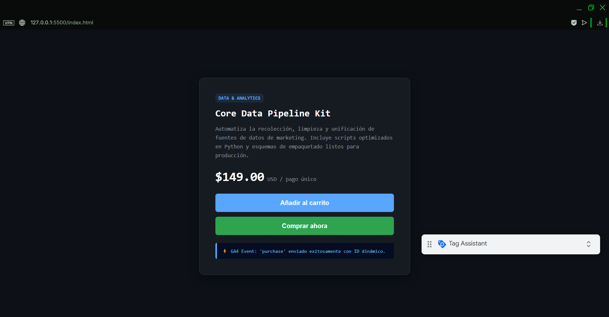
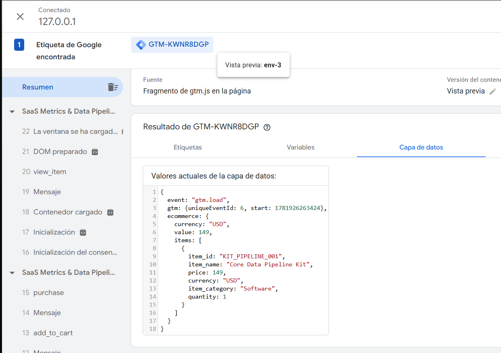
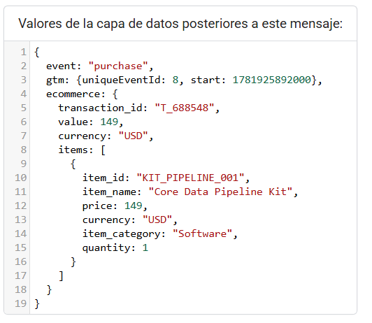

🇺🇸 Inglés: > E-commerce tracking laboratory for structuring and testing event data pipelines using Google Tag Manager and GA4.

🇪🇸 Español:

Laboratorio de tracking e-commerce para estructurar y probar flujos de datos de eventos con Google Tag Manager y GA4.

# ga4-datalayer-architecture

E-commerce tracking laboratory for structuring and testing event data pipelines using Google Tag Manager and GA4.

# GA4 & GTM Enhanced Ecommerce: DataLayer Architecture Lab

## Project Summary
This repository contains an isolated testing environment (Sandbox) designed to audit, structure, and validate the data layer (`window.dataLayer`) in Google Analytics 4 (GA4) implementations for e-commerce.

The main objective is to demonstrate the correct orchestration of standard events (`view_item`, `add_to_cart`, `purchase`), avoiding context loss and accidental variable overwriting, ensuring a clean and structured payload for ingestion into marketing platforms.

## Tech Stack
* Architecture: JavaScript (Vanilla), HTML5, CSS3.
* Analytics & Tracking: Google Tag Manager (GTM), GA4 Enhanced Ecommerce API.
* Debugging Tools: Google Tag Assistant, Localhost Server.

## Evidence of Execution and Debugging

1. Test Interface

2. GTM Trigger Flow (Event Pipeline)

3. DataLayer Autopsy (JSON Payload)
*Data structure captured during the final transaction event. Shows the exact format required by Google Analytics, including dynamic IDs and item hierarchy.*

## How to run this laboratory locally
To replicate this architecture:
1. Clone the repository.
2. Inject a valid GTM container ID into the `<script>` tags of the `index.html` file.
3. Deploy through a secure local server.
4. Connect the environment with Google Tag Assistant to monitor the data flow.

---
Developed as a technical case study for the resolution and debugging of web analytics architectures.

# ga4-datalayer-architecture

Laboratorio de tracking e-commerce para estructurar y probar flujos de datos de eventos con Google Tag Manager y GA4.

# GA4 & GTM Enhanced Ecommerce: DataLayer Architecture Lab

## Resumen del Proyecto
Este repositorio contiene un entorno de pruebas aislado (Sandbox) diseñado para auditar, estructurar y validar la capa de datos (`window.dataLayer`) en implementaciones de Google Analytics 4 (GA4) para comercio electrónico. 

El objetivo principal es demostrar la correcta orquestación de eventos estándar (`view_item`, `add_to_cart`, `purchase`) evitando la pérdida de contexto y la sobreescritura accidental de variables, asegurando un *payload* limpio y estructurado para la ingesta de datos en plataformas de marketing.

## Stack Tecnológico
* Arquitectura: JavaScript (Vanilla), HTML5, CSS3.
* Analítica & Tracking: Google Tag Manager (GTM), GA4 Enhanced Ecommerce API.
* Herramientas de Depuración: Google Tag Assistant, Localhost Server.

## Evidencia de Ejecución y Depuración

1. Interfaz de Pruebas 
 

2. Flujo de Gatillos en GTM (Event Pipeline)

3. Autopsia del DataLayer (Payload JSON)
*Estructura de datos capturada durante el evento de transacción final. Muestra el formato exacto requerido por Google Analytics, incluyendo IDs dinámicos y jerarquía de ítems.*

## Cómo ejecutar este laboratorio localmente
Para replicar esta arquitectura:
1. Clonar el repositorio.
2. Inyectar el ID de un contenedor de GTM válido en las etiquetas `<script>` del archivo `index.html`.
3. Desplegar a través de un servidor local seguro.
4. Conectar el entorno con Google Tag Assistant para monitorear el flujo de datos.

---
Desarrollado como caso de estudio técnico para la resolución y depuración de arquitecturas de analítica web.